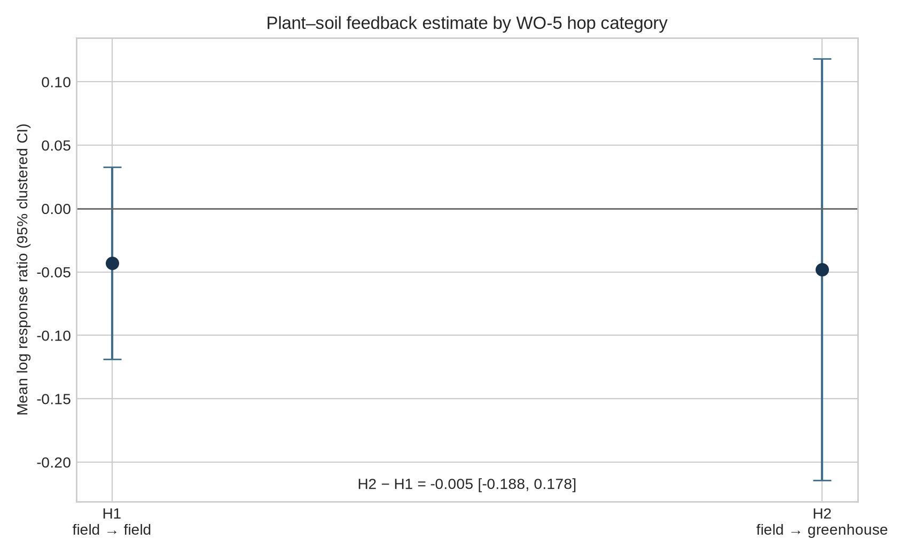
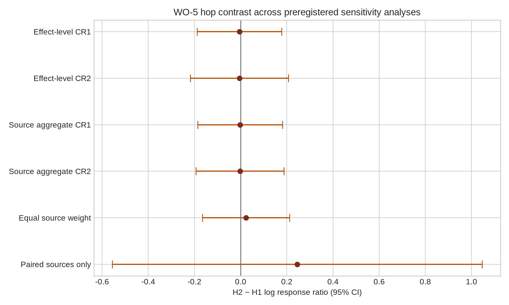
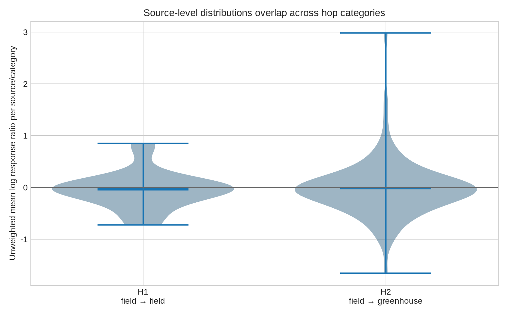

# WO-5 statistical analysis results

**Author:** Manus AI

## Primary categorical fallback

Only H1 and H2 met the preregistered thresholds, so no three-category ordinal hop model was fit.[1] The analysis includes 1,523 effect rows from 111 source studies. H1 contributes 326 effects from 23 studies; H2 contributes 1,197 effects from 91 studies. The remaining 4,446 rows are excluded because the public metadata do not establish a unique hop category. The selected source is the public Jiang *et al.* plant–soil-feedback synthesis and its CC0 Dryad dataset.[2] [3]

The effect-level random-effects meta-regression estimates H1 at **-0.0429 (95% CI -0.1186 to 0.0329; p=0.2646)** and H2 at **-0.0481 (95% CI -0.2144 to 0.1181; p=0.5671)**. The primary H2-minus-H1 contrast is **-0.0053 (95% CI -0.1884 to 0.1778; p=0.9546)**. The estimated residual heterogeneity is tau-squared = 0.3638. Standard errors are clustered by source study.

## Sensitivity analyses

After inverse-variance aggregation within each source-study/category cell, the H2-minus-H1 contrast is **-0.0028 (95% CI -0.1867 to 0.1811; p=0.9759)** across 114 cells from 111 sources. Giving each source-category cell equal weight yields **0.0234 (95% CI -0.1652 to 0.2120; p=0.8061)**. Among the 3 source studies represented in both H1 and H2, the paired random-effects contrast is **0.2448 (95% CI -0.5560 to 1.0455; p=0.319)**.

The source-aggregated leave-one-study-out estimates range from -0.0426 to 0.0337. The count-preserving source-level permutation uses 4,999 replicates, fixes tau-squared and cell weights across draws, preserves all 91 H2 cells, and returns a two-sided p-value of 0.9824. Every positively coded row has high provenance confidence, so the preregistered high-confidence sensitivity is identical to the primary dataset.

The CR2/Satterthwaite sensitivity gives H2-minus-H1 = -0.0053 (95% CI -0.2181 to 0.2075; df=13.58; p=0.9582) at effect level and -0.0028 (95% CI -0.1931 to 0.1875; df=33.40; p=0.9762) after source-category aggregation.

The secondary magnitude outcome remains descriptive. Mean absolute log response ratio is 0.2699 for H1 and 0.4639 for H2; medians are 0.1820 and 0.2664, respectively. After averaging absolute values within each source/category, the means are 0.3299 and 0.4774; the medians are 0.2422 and 0.3608. No inferential test is attached to the absolute-value transformation.

## Interpretation boundary

The reported contrast is an association between setting-defined hop categories and plant–soil-feedback log response ratios. Hop category is inseparable here from field versus greenhouse feedback setting and differs in source-study composition: 20 sources are H1-only, 88 are H2-only, and only 3 contain both categories. The analysis therefore cannot attribute the contrast to information loss, ecological realism, or hop distance itself. It is predominantly a between-source comparison, not a causal or within-source carry estimate. The primary confidence interval is not contained within the preregistered ±log(1.10) small-effect region (±0.0953); the analysis therefore shows no detectable contrast but does not establish practical equivalence. This interpretation follows the independent statistical and ecological reviews.[4] [5]

## Reproducibility

The input hash is `77dc735fa425abd96329acbc55a99c6403f7da77b947f3b1cc7d61a9ec612480`. The complete input is [`hop-coded-effects.csv`](hop-coded-effects.csv), and the executable is [`analyze_hop_distance.py`](analyze_hop_distance.py). Exact estimates are saved in [`model-results.json`](model-results.json) and [`model-summary.csv`](model-summary.csv). The repository also retains [`study-category-aggregates.csv`](study-category-aggregates.csv), [`leave-one-study-out.csv`](leave-one-study-out.csv), [`permutation-results.csv`](permutation-results.csv), [`category-counts.csv`](category-counts.csv), and [`magnitude-summary.csv`](magnitude-summary.csv). Run from the repository root with `python3 research/wo-5/analysis/analyze_hop_distance.py` under the versions in [`requirements.txt`](requirements.txt).

## References

[1]: ../ecology-codebook.md "WO-5 ecology carry-test codebook"

[2]: https://doi.org/10.1111/ele.14364 "Global patterns and drivers of plant–soil microbe interactions"

[3]: https://doi.org/10.5061/dryad.n2z34tn35 "Dataset of global plant-soil feedback"

[4]: ../validation/statistical-analysis.md "Independent validation of the H1-versus-H2 meta-analysis"

[5]: ../validation/ecological-interpretation.md "Independent ecological methods review"
